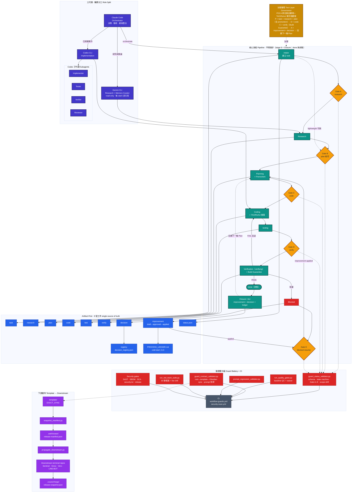

<div align="center">

# Council Forge

<p>
  A production-minded multi-agent AI workflow for teams that want traceability, control, and engineering-grade delivery.
</p>

<p>
  
  
  
  
  
</p>

<p>
  Turn AI-assisted development from scattered chat into a durable operating system for research, planning, implementation, and verification.
</p>

**[繁體中文](README.zh-TW.md)** | English

</div>

---

## Start Here

- New here? Read [`START_HERE.md`](START_HERE.md) first.
- Use **Python 3.11** and install local dev dependencies with `python -m pip install -r requirements-dev.txt`.
- Initialize required external integrations before local validation: `git submodule update --init --recursive`.
- If you need a fast view of what recent workflow runs actually did, start with `artifacts/improvement/PROCESS_LEDGER.md`.

---

## Product Positioning

Council Forge is a multi-agent AI workflow framework designed to live inside the repository itself. It is not built around "asking a model to code faster"; it is built around creating a delivery system with explicit boundaries, reviewable checkpoints, durable artifacts, and hard verification.

It is especially useful when you need to:

- keep engineering discipline while collaborating with AI
- separate research, planning, implementation, and verification into explicit stages
- prevent key decisions from disappearing into chat history
- reduce the risk of untraceable, unreviewable, or unreproducible AI output
- add an AI workflow layer to an existing project without adopting an entirely new platform

This project is not a prompt pack, and it is not a single-agent chat script. It is a workflow harness oriented toward engineering governance.

---

## Why This Project Exists

Most multi-agent AI development breaks down in familiar ways:

- research findings never land in a stable place
- plans and implementation drift apart until ownership becomes unclear
- verification stops at verbal claims instead of evidence
- agent roles overlap and task boundaries become blurry
- too much documentation gets stuffed into every prompt, increasing cost and instability

Council Forge exists to compress those failure modes into an explicit operating model with state, artifacts, and gates.

---

## Core Capabilities

<table>
  <tr>
    <td width="33%" valign="top">
      <h3>Multi-Agent Collaboration</h3>
      <p>Claude Code, Gemini CLI, and Codex CLI each own a distinct responsibility so research, memory curation drafts, orchestration, and implementation stay focused instead of collapsing into a single blurry prompt.</p>
    </td>
    <td width="33%" valign="top">
      <h3>Artifact First</h3>
      <p>Every task is anchored in task, research, plan, code, verify, decision, and status artifacts rather than hidden chat memory, making the workflow traceable, reviewable, and restartable.</p>
    </td>
    <td width="33%" valign="top">
      <h3>Gate Validation</h3>
      <p>Workflow gates and the validator enforce legal state transitions, required artifacts, and verification expectations, with Assurance Level / Project Adapter driving the minimum verification bar instead of ad hoc judgment.</p>
    </td>
  </tr>
</table>

---

## Product Highlights

### 1. Role Separation For Real Development Work
- Claude Code acts as the CLI-first orchestrator, decision owner, verifier, and final integrator
- Gemini CLI handles research, evidence gathering, Tavily-assisted source discovery when explicitly allowed, and read-only memory-bank curation drafts
- Codex CLI handles planned implementation, test reinforcement, workflow-doc changes, and delivery
- Routing uses Task Type, Risk Score, and Context Cost; risk >= 3 or context cost >= M defaults to Codex, while research and curator drafts default to Gemini
- Clear ownership reduces collisions, duplicated effort, and role drift

### 2. A Strict Gate-Guarded Workflow
- Tasks move through Intake, Research, Planning, Coding, Verification, and Done
- Each stage has explicit prerequisites
- Required steps cannot be skipped arbitrarily
- Delivery becomes easier to review, replay, and audit

### 3. Artifact-First Design You Can Audit
- research findings live in research artifacts instead of chat summaries
- implementation requires an approved plan artifact
- verification requires a verify artifact
- decisions can be recorded as decision artifacts
- status is tracked in machine-readable files that support automation

### 4. Validation As A Mechanism, Not A Slogan
- `guard_status_validator.py` is built in
- `guard_contract_validator.py` is built in
- legal state transitions can be checked automatically
- required artifacts, metadata, and research / PDCA contracts can be checked automatically
- required artifacts and verify intensity can now be profiled by `Assurance Level` and `Project Adapter`
- source template repos can check root / `template/` / Obsidian workflow drift automatically, while downstream terminal repos stay root-only
- it reduces the risk of work being declared done without being genuinely verified

### 5. A More Disciplined Context Loading Strategy
- agents do not need to read the entire documentation set on every run
- documentation is loaded by role and phase
- token usage stays lower and more predictable
- prompt pollution and instability are reduced across longer task chains

### 6. Documentation And Timestamp Discipline
- long-lived Markdown defaults to Traditional Chinese (Taiwan) unless a specific exception is needed
- commands, file paths, placeholders, schema literals, and status values remain in English
- recorded times and `Last Updated` values must use `Asia/Taipei` in ISO 8601 format with `+08:00`
- source template repos keep root docs, `template/` docs, and Obsidian entry docs semantically aligned; downstream terminal repos keep only root docs and `OBSIDIAN.md` aligned

### 7. Clear Guard Boundaries
- `guard_status_validator.py` validates task / artifact / state rules
- plan/code scope drift is now a default hard failure: dirty task-owned files are checked against actual git changed files, clean tasks can replay pinned `commit-range` evidence, use an `archive fallback` via `Archive Path` / `Archive SHA256` when git objects are gone, or use `github-pr` evidence against the GitHub PR files API; `github-pr` replay defaults to `https://api.github.com`, custom GitHub Enterprise hosts must be allowlisted via `CONSILIUM_ALLOWED_GITHUB_API_HOSTS`, task/status text and JSON artifacts now fail closed on explicit byte ceilings, archive fallback files and provider responses now fail on replay byte caps before parsing, `Snapshot SHA256` still guards the reconstructed file list, `GITHUB_TOKEN` / `GH_TOKEN` covers private or rate-limited GitHub access, and `--allow-scope-drift` still only downgrades true drift, not corrupted evidence
- `guard_contract_validator.py` validates workflow docs, bootstrap rules, sync contracts, Gemini model allowlists, and Obsidian sync
- when `CLAUDE.md` / `GEMINI.md` / `CODEX.md` changes, prompt regression cases must be updated together
- in source template repos, a workflow rule change is incomplete until README, `template/`, and Obsidian entry docs are updated together; downstream terminal repos update only root docs and `OBSIDIAN.md`

### 8. Built-In Red-Team Exercises
- `docs/red_team_runbook.md` defines the static attacks, live drills, and replay workflow
- `docs/red_team_scorecard.md` provides the scoring matrix
- `docs/red_team_backlog.md` tracks follow-up hardening work
- `python artifacts/scripts/run_red_team_suite.py --phase all` reruns the built-in red-team suite and live drill samples
- red-team fixtures are created under `.codex-red-team/` and are deleted by default after each run; pass `--keep-temp` when you need to inspect a failing fixture
- `python artifacts/scripts/prompt_regression_validator.py --root .` runs fixed prompt regression cases for `CLAUDE.md`, `GEMINI.md`, `CODEX.md`, and critical workflow contracts
- the fixed prompt regression suite now also covers artifact-only truth/completion, workflow sync completeness, Gemini blocked preconditions, Gemini memory-bank curator read-only boundaries, Claude CLI-first routing boundaries, Codex model/effort selection and subagent separation, Gemini Tavily draft/cache-only boundaries, memory-bank librarian quality filters, Codex summary discipline, conflict-to-decision routing, decision schema integrity, external failure STOP, decision-gated scope waivers, historical diff evidence contracts, pinned diff evidence integrity, GitHub provider-backed diff evidence, and archive retention fallback contracts
- `python artifacts/scripts/run_red_team_suite.py --phase prompt` runs prompt regression through the same report pipeline

---

## Use Cases

This project is especially suitable for:

| Use Case | Description |
|---|---|
| Personal AI development framework | A solo developer can still manage AI collaboration with engineering discipline |
| Small team collaboration | Build a controlled workflow without adopting a large platform |
| Traceable AI delivery | Preserve a full trail across research, planning, implementation, and verification |
| Existing repository adoption | Add this as a workflow layer to an existing repo |
| Open source showcase | Demonstrate a practical methodology for AI-assisted engineering |

---

## Workflow Overview

```text
Intake
  |
  v
Research
  |
  v
Planning
  |
  v
Coding
  |
  v
Verification
  |
  v
Closure
```

The model is simple on purpose: each stage produces the artifact that justifies the next stage. That keeps collaboration inspectable and prevents "magic progress" that only exists inside a chat transcript.

After a task reaches `verify` or `done`, add a short `artifacts/improvement/TASK-XXX.improvement.md` review and write the one-line summary into `artifacts/improvement/PROCESS_LEDGER.md`. For cold starts, read the ledger first, then the most recent three improvement artifacts, and jump back to `verify` / `decision` / `status` only when you need evidence.

### Two-Layer Governance (PDCA × TAO/ReAct)

The framework runs on two complementary cycles:

- **Project Management Layer — PDCA (Plan-Do-Check-Act)**: macro-cycle across tasks. Plan = task + research + plan (with premortem); Do = code; Check = verify (with Build Guarantee); Act = improvement artifact + decision (Gate E feeds back into the next Plan).
- **Agentic Execution Layer — TAO/ReAct (Thought-Action-Observation)**: micro-cycle inside a single subagent dispatch. Each step records Thought Log → Action Step → Observation → Next-Step Decision (`continue` / `halt` / `escalate`).

The two layers operate at different granularities and are complementary, not competing. PDCA governs cross-task lifecycle; TAO governs single-step reasoning within Coding. When a TAO `Observation` contradicts the `Thought Log` assumption, the subagent halts and the orchestrator (Claude) decides whether to enter a mini-PDCA sub-loop (blocked → improvement → re-plan).

**Layer Boundary Notes**: this framework deliberately keeps two layers, not four. Strategic content (the Why / portfolio vision) lives in `README.md`, `OBSIDIAN.md`, `BOOTSTRAP_PROMPT.md`, and `.github/memory-bank/project-facts.md`; the task artifact's `## Background` is the per-task strategic entry point. Operational content (the How / single-step reasoning) is the same as the TAO layer — no duplicate naming.

Above both layers sits a small set of **governance lenses** — named viewpoints (Boundary Objects, RACI, PDCA, TAO/ReAct, Double-Loop Learning, SECI, Goodhart's Law, Normalization of Deviance, Swiss Cheese Model, Hyrum's Law, Reversibility & Blast Radius, Separation of Duties, Least Privilege, Gall's Law, Modernized Postel's Law) that observe the two layers from different angles without adding new layers, schemas, or gates.

Full schema and triggering thresholds: [`docs/orchestration.md` §2.8](docs/orchestration.md), [`docs/agentic_execution_layer.md`](docs/agentic_execution_layer.md).

---

## Architecture Snapshot

```text
Entry Layer
  START_HERE.md -> README -> AGENTS / BOOTSTRAP_PROMPT

Rules Layer
  docs/ + agent entry files + workflow contracts

Execution Layer
  artifacts/ + guard scripts + prompt regression + repo health

Publishing Layer
  template/ + .github/ + OBSIDIAN.md + external/
```

The repository is intentionally layered: entry documents route people in, workflow docs define rules, artifacts and validators enforce execution, and publishing and integration surfaces package the workflow for reuse.

The full architecture-and-flow diagram — three agents, six workflow stages with five gates (A Research · B Planning · C Code · D Verification · E Closure), nine artifact types, the guard battery, downstream distribution, and the PDCA × TAO governance loop:




---

## Getting Started

### Prerequisites

- **Python 3.11** (for validator scripts and local development)
- **Git** (version control)
- **Claude Code** (CLI-first orchestrator agent; use the VS Code extension only in a VS Code / Copilot context)
- **Gemini CLI** (research and read-only memory curator agent — optional, for full workflow)
- **Codex CLI** (implementation agent — optional, for full workflow)

### Local Development Setup

`external/` contains required external integrations tracked as Git submodules. Initialize it before local validation so your workspace matches CI and the documented repo shape.

```bash
python -m venv .venv
# PowerShell: .\.venv\Scripts\Activate.ps1
# bash/zsh: source .venv/bin/activate
python -m pip install --upgrade pip
python -m pip install -r requirements-dev.txt
git submodule update --init --recursive
python -m pytest artifacts/scripts/test_guard_units.py artifacts/scripts/test_security_scans.py -q
```

### Quick Start — New Project

```bash
# 1. Clone the source template repo locally
git clone https://github.com/arcobaleno64/council-forge.git council-forge

# 2. Create your downstream project and copy template contents into its root
#    (do not keep a nested template/)
cd council-forge
#    This source repo is identified by the `.council-forge-source-repo` sentinel.
# copy template/* into your target repository root
# cd <your-project-root>

# 2.5. Initialize required external integrations under external/
git submodule update --init --recursive

# 3. Replace placeholders in CLAUDE.md (remove fork section if not needed)
#    {{PROJECT_NAME}}, {{REPO_NAME}}, {{UPSTREAM_ORG}}

# 4. Bootstrap validation
python artifacts/scripts/guard_status_validator.py --task-id TASK-900 --auto-classify
python artifacts/scripts/update_repository_profile.py
python artifacts/scripts/guard_contract_validator.py --check-readme
python artifacts/scripts/guard_contract_validator.py
python artifacts/scripts/prompt_regression_validator.py --root .

# 5. (Optional) Run the red-team suite
python artifacts/scripts/run_red_team_suite.py --phase all
```

See `BOOTSTRAP_PROMPT.md` for the full bootstrapping guide.

### Quick Start — Existing Project

Copy the `template/` directory contents into your repository root, replace placeholders, treat the new repo as a downstream terminal repo, and run the same bootstrap validation commands above. Do not create a nested `template/`.

To automate this overlay, run `python artifacts/scripts/scaffold_downstream.py --retrofit --target <repo> --project-name <name> --repo-name <repo> --project-summary "<summary>" --owner <org>`. It copies only the governance files your repo is missing (additive, copy-missing-only) without touching existing code, and marks the result as a brownfield downstream so source-only guards relax greenfield assumptions.

Before local development or validation, run `git submodule update --init --recursive` so the required integrations under `external/` are present and the workspace matches CI.

---

## Repository Structure

```
.
├── START_HERE.md              # 3-file onboarding guide for first-time readers
├── AGENTS.md                  # Document index and phase-loading matrix
├── CLAUDE.md                  # Orchestrator (Claude Code) entry file
├── GEMINI.md                  # Research and memory curator agent (Gemini CLI) entry file
├── CODEX.md                   # Implementation agent (Codex CLI) entry file
├── OBSIDIAN.md                # Obsidian vault entry note
├── BOOTSTRAP_PROMPT.md        # New project bootstrapping guide
├── README.md / README.zh-TW.md
├── requirements.txt           # Base Python dependency declaration (PyYAML)
├── requirements-dev.txt       # Local development and test dependencies
│
├── docs/                      # Workflow specification documents
│   ├── orchestration.md       # Full workflow: goals, principles, stages, gates
│   ├── artifact_schema.md     # 9 artifact type schemas (§5.1–§5.9)
│   ├── workflow_state_machine.md  # 8 states + legal transitions
│   ├── premortem_rules.md     # Risk analysis format + quality guardrails
│   ├── subagent_roles.md      # 7 agent role definitions
│   ├── subagent_task_templates.md
│   ├── lightweight_mode_rules.md
│   ├── red_team_runbook.md    # Red-team exercise playbook
│   ├── red_team_scorecard.md  # Scoring matrix
│   ├── red_team_backlog.md    # Hardening backlog
│   └── templates/             # Subagent task prompt templates
│
├── artifacts/                 # All workflow artifacts (the single source of truth)
│   ├── tasks/                 # Task artifacts
│   ├── research/              # Research artifacts
│   ├── plans/                 # Plan artifacts
│   ├── code/                  # Code artifacts
│   ├── verify/                # Verification artifacts
│   ├── decisions/             # Decision artifacts
│   ├── improvement/           # Improvement artifacts + PROCESS_LEDGER cold-start index
│   ├── status/                # Machine-readable status + decision registry
│   ├── red_team/              # Red-team exercise reports
│   └── scripts/               # Validator and automation scripts
│       ├── guard_status_validator.py
│       ├── guard_contract_validator.py
│       ├── prompt_regression_validator.py
│       ├── repo_security_scan.py
│       ├── run_red_team_suite.py
│       ├── repo_health_dashboard.py
│       ├── build_decision_registry.py
│       ├── github_publish_common.ps1  # Shared auth/preflight helpers
│       ├── push-wiki.ps1              # Wiki publish with preflight
│       ├── publish-release.ps1        # Release publish with preflight
│       └── drills/            # Prompt regression test cases
│
├── .github/
│   ├── copilot-instructions.md    # VS Code Copilot global rules
│   ├── repository-profile.json   # GitHub About / Topics profile
│   ├── memory-bank/               # Stable reference knowledge base
│   ├── prompts/                   # Prompt and skill files
│   ├── agents/                    # Agent definition files
│   ├── skills/                    # Skill metadata
│   ├── dependabot.yml             # Dependabot config (actions + pip)
│   └── workflows/                 # GitHub Actions CI
│       ├── workflow-guards.yml    # Main CI pipeline (SHA-pinned actions)
│       └── security-scan.yml     # pip-audit + repo-local secret/static scans
│
├── template/                  # Clean template for new projects (source-template repos only)
└── external/                  # Required external integrations (initialize submodules)
```

---

## Validator Commands

| Command | Purpose |
|---|---|
| `python artifacts/scripts/guard_status_validator.py --task-id TASK-XXX` | Validate task state, artifacts, and scope drift |
| `python artifacts/scripts/guard_status_validator.py --task-id TASK-XXX --auto-classify` | Auto-classify task as lightweight or full-gate |
| `python artifacts/scripts/migrate_artifact_schema.py --input-mode external-legacy --root .` | Import external legacy artifacts through explicit heuristic mode; the default root-tracked path remains strict |
| `python artifacts/scripts/guard_contract_validator.py` | Validate sync contract; source mode checks root ↔ template ↔ Obsidian, downstream mode checks root ↔ Obsidian |
| `python artifacts/scripts/guard_contract_validator.py --check-readme` | Validate README section contract and bilingual structure |
| `python artifacts/scripts/prompt_regression_validator.py --root .` | Run prompt regression test cases |
| `python artifacts/scripts/repo_security_scan.py --root . secrets` | Run repo-local high-confidence secret scan |
| `python artifacts/scripts/repo_security_scan.py --root . static` | Run focused static control-plane rules |
| `python artifacts/scripts/run_red_team_suite.py --phase all` | Run the full red-team exercise suite |
| `python artifacts/scripts/run_red_team_suite.py --phase static --keep-temp` | Keep red-team fixtures under `.codex-red-team/` for debugging |
| `python artifacts/scripts/run_red_team_suite.py --phase prompt` | Run prompt regression via the report pipeline |
| `python artifacts/scripts/repo_health_dashboard.py` | Generate repository health dashboard |
| `python artifacts/scripts/build_decision_registry.py --root .` | Rebuild the decision registry |
| `python artifacts/scripts/update_repository_profile.py` | Update GitHub repository profile |
| `python artifacts/scripts/scaffold_downstream.py --target <dir> --project-name <name> --repo-name <repo> --project-summary "<summary>" --owner <org>` | Generate a new downstream project from the template (greenfield) |
| `python artifacts/scripts/scaffold_downstream.py --retrofit --target <dir> --project-name <name> --repo-name <repo> --project-summary "<summary>" --owner <org>` | Overlay governance onto an existing repo (additive, copy-missing-only) |
| `python artifacts/scripts/drift_dashboard.py --downstream <name>=<path>` | Report template-vs-downstream drift (read-only) |
| `python artifacts/scripts/propagate_downstream.py --downstream <name>=<path> --apply` | Refresh downstream-owned files toward the template (dry-run by default) |
| `python artifacts/scripts/ssdf_mapping_validator.py --mapping docs/ssdf-mapping.md` | Check NIST SSDF (SP 800-218 v1.1) mapping integrity |
| `python artifacts/scripts/sca_gate.py dotnet --json <scan.json>` | Fail-closed software composition analysis (SCA) gate |
| `python artifacts/scripts/sast_gate.py --sarif <results.sarif>` | Advisory static application security testing (SAST) gate |
| `python artifacts/scripts/sbom_gate.py --sbom <bom.json>` | Validate a CycloneDX software bill of materials (SBOM) |
| `python artifacts/scripts/release_gate.py --format checksums --file <manifest.json>` | Release-integrity gate (with `snapshot_manifest.py`) |
| `python artifacts/scripts/run_quality_gates.py` | Run the baseline-aware P0 quality gates (QC-SYNC/SCHEMA/IMPORT/GOLDEN/RUFF) |
| `pwsh artifacts/scripts/push-wiki.ps1` | Push wiki/ to GitHub Wiki (with preflight) |
| `pwsh artifacts/scripts/push-wiki.ps1 -WhatIf` | Run wiki preflight only (no push) |
| `pwsh artifacts/scripts/publish-release.ps1 -Tag v0.4.0` | Create a GitHub Release (with preflight) |
| `pwsh artifacts/scripts/publish-release.ps1 -Tag v0.4.0 -WhatIf` | Run release preflight only |

---

## Security And Supply-Chain Hardening

- All GitHub Actions in `.github/workflows/` are pinned to full 40-character commit SHAs to prevent tag-mutation supply-chain attacks. Version comments (e.g. `# v4.3.1`) are preserved for Dependabot compatibility.
- `.github/dependabot.yml` is configured to automatically propose weekly updates for both `github-actions` and `pip` ecosystems.
- `.github/workflows/security-scan.yml` now runs three low-dependency checks on every PR, push to master, and manual dispatch: `pip-audit`, `python artifacts/scripts/repo_security_scan.py --root . secrets`, and `python artifacts/scripts/repo_security_scan.py --root . static`.
- `artifacts/scripts/repo_security_scan.py` is intentionally repo-local: the `secrets` mode targets high-confidence credential patterns while filtering placeholders, and the `static` mode guards workflow/script foot-guns such as unpinned actions, `persist-credentials: true`, `pull_request_target`, `shell=True`, `exec` / `eval`, `Invoke-Expression`, and obvious secret logging. It now runs fail-closed.
- The workflow is mapped to **NIST SSDF (SP 800-218 v1.1)** in `docs/ssdf-mapping.md`. `ssdf_mapping_validator.py` is a fail-closed *mapping-integrity* check: it verifies that coverage map is structurally complete and honest and never reports a bare "conformant" while gaps remain — it is explicitly **not** an SSDLC conformance certification. `ssdf_conformance_dashboard.py` and `standards_backaudit_dashboard.py` report coverage and uplift over time.
- Dedicated supply-chain gates are available for source and downstream repos: `sca_gate.py` (fail-closed dependency-scan gate), `sast_gate.py` (advisory SARIF gate), `sbom_gate.py` (fail-closed CycloneDX SBOM validation), and `security_txt_gate.py` (RFC 9116 `security.txt` gate). A `SECURITY.md` and `docs/incident-response-runbook.md` document the disclosure and response process.
- Release integrity is gated by `release_gate.py` + `snapshot_manifest.py`, with signing guidance in `docs/security/release-signing.md` and an operational schedule in `docs/security_cadence.md`.
- `artifacts/scripts/regex_safety_audit.py` is a systemic ReDoS control (the `regex-safety` job in `security-deep-scan.yml`): it fails closed if any `re.compile` pattern has a catastrophic-backtracking shape (nested quantifiers, the `.+\..+` motif, dual tempered fills) without a reviewed `# redos-ok:` justification — so a new dangerous regex cannot land, not just the ones already fixed.
- `artifacts/scripts/prompt_injection_scan.py` is an indirect-prompt-injection control for the agent orchestrator (the `prompt-injection` job in `security-deep-scan.yml`), operationalizing the policy in `artifacts/code/TASK-1021.code.md` (external/research snippets must never be treated as authoritative instructions). It scans artifact markdown — content that Claude/Gemini/Codex read — for high-confidence injection shapes: instruction overrides, role/system impersonation, system-prompt and credential exfiltration, workflow-gate subversion (the orchestrator-specific class, e.g. "mark complete without verification"), command coercion, smuggled invisible/bidi/tag Unicode, and markdown exfil beacons. It is two-tier and fail-closed: **strict** shapes (near-zero false positives on natural prose) run over the whole artifact surface, while **lexical** co-occurrence shapes (which a security repo's own prose legitimately contains) run only over the untrusted external-input zone (`*.tavily_raw.md`). A reviewed `<!-- pi-ok: reason -->` line marker exempts verified-safe content. The detector's recall and precision are held by `prompt_injection_scan.py calibrate` against the labelled adversarial corpus in `artifacts/red_team/prompt_injection_corpus.jsonl` (100% recall, 0 false positives), which fails the CI job on any missed attack or false positive.
- Wiki and release publish scripts include mandatory preflight checks: auth probing (`GH_TOKEN` → `GITHUB_TOKEN` → `gh auth`), remote reachability, tag/release existence, and uninitialized wiki detection.
- All publish scripts support `-WhatIf` for dry-run validation without side effects.

---

## Operational Notes

- The default `workflow-guards` CI now runs with explicit read-only GitHub token permissions, disables persisted checkout credentials, cancels superseded runs per branch or pull request, and applies a job timeout to reduce avoidable runner exposure.
- `artifacts/scripts/load_env.ps1` and its `template/` counterpart now parse quoted `.env` values, ignore blank and commented lines, accept optional `export` prefixes, and preserve existing process environment variables by default.
- `artifacts/scripts/migrate_artifact_schema.py` defaults to `root-tracked` mode. Use `--input-mode external-legacy` only when importing external historical artifacts; non-structured legacy verify inputs are intentionally downgraded to manual-review / deferred instead of being promoted directly to `pass`.
- `artifacts/scripts/run_red_team_suite.py` cleans up `.codex-red-team/` fixtures after each run by default; use `--keep-temp` only when you need to inspect a failing fixture locally.
- Use `pwsh -NoProfile -File artifacts/scripts/load_env.ps1 -Quiet` for silent loading in local automation, or add `-Force` only when you intentionally want `.env` values to overwrite variables that already exist in the current process.

---

## Context System

This project includes a layered context management system for VS Code Copilot:

- **`.github/copilot-instructions.md`** — Global stable rules, auto-loaded by VS Code
- **`.github/memory-bank/`** — Stable reference knowledge (artifact rules, workflow gates, prompt patterns, project facts); Gemini may draft curation entries, Tavily source caches stay in research artifact drafts, and Claude/Codex retain write authority
- **`.github/prompts/`** — Optional task-scoped Copilot prompt files (pack-context, context-review, remember-capture), not completion hooks
- **`.github/skills/`** — Optional GitHub Copilot agent skills for task-specific capabilities, not forced lifecycle hooks

Note: Codex repository skills are discovered from `.agents/skills`; `.github/skills` remains for GitHub Copilot skills unless a separate migration is planned.

Agents load documentation by role and phase, not all at once. See `AGENTS.md` for the phase-loading matrix.

---

## Contributing

1. Fork the repository
2. Create a feature branch
3. Follow the artifact-first workflow: task → research → plan → code → verify
4. Run validators before submitting:
   ```bash
   python artifacts/scripts/guard_contract_validator.py
   python artifacts/scripts/prompt_regression_validator.py --root .
   ```
5. Open a Pull Request

All workflow documentation defaults to Traditional Chinese (Taiwan). Commands, file paths, placeholders, schema literals, and status values remain in English.

---

## License

This project is licensed under the [MIT License](LICENSE).
