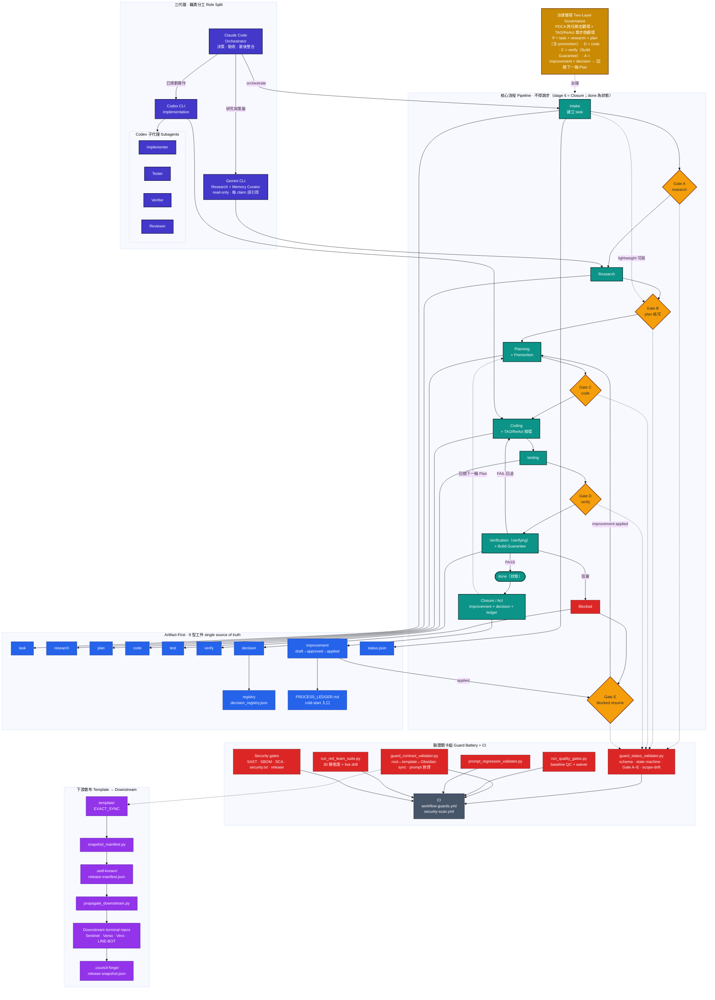

<div align="center">

# Council Forge

<p>
  一套面向實務開發的多 Agent AI 協作工作流框架，強調 artifact-first、gate-guarded 與可驗證交付。
</p>

<p>
  
  
  
  
  
</p>

<p>
  讓 AI 開發流程從零散對話，變成可追蹤、可交接、可驗證的工程化交付機制。
</p>

繁體中文 | **[English](README.md)**

</div>

---

## 從這裡開始

- 第一次進 repo 時，先看 [`START_HERE.md`](START_HERE.md)。
- 本地開發與驗證統一使用 **Python 3.11**，並以 `python -m pip install -r requirements-dev.txt` 安裝開發相依。
- 進行本地驗證前，先執行 `git submodule update --init --recursive` 初始化 `external/` 內的必要外部整合。
- 若想快速理解最近幾次流程實際做了什麼，先看 `artifacts/improvement/PROCESS_LEDGER.md`。

---

## 產品定位

Council Forge 是一套可嵌入專案儲存庫的多 Agent AI 工作流框架，設計目標不是單純「叫模型幫你寫程式」，而是建立一條有邊界、有檢查點、有產物紀錄的開發流程。

它特別適合以下需求：

- 希望在 AI 協作下仍保有工程紀律
- 需要把研究、規劃、實作、驗證拆分成明確階段
- 不希望所有關鍵決策都藏在聊天上下文裡
- 想降低 AI 產出不可追溯、不可審核、不可重現的風險
- 想把多 Agent 協作導入既有專案，而不是另起一套平台

它不是聊天腳本集合，也不是單一代理人的 prompt 範本，而是一個偏工程治理導向的 workflow harness。

---

## 為什麼是這個專案

多 Agent 開發常見的問題很一致：

- 研究結果沒有固定落點，之後無法回查
- 計畫與實作脫鉤，最後誰改了什麼說不清楚
- 驗證只停留在口頭聲明，沒有足夠證據
- Agent 角色重疊，導致任務邊界混亂
- 每次都把整包文件塞進上下文，成本高又不穩定

Council Forge 的核心價值，在於把這些常見失控點收斂成一套有狀態、有產物、有 gate 的工作流。

---

## 核心能力

<table>
  <tr>
    <td width="33%" valign="top">
      <h3>多 Agent 協作</h3>
      <p>透過 Claude Code、Gemini CLI、Codex CLI 的角色分工，讓研究、memory curation draft、協調、實作各自聚焦，降低責任漂移與上下文混亂。</p>
    </td>
    <td width="33%" valign="top">
      <h3>Artifact First</h3>
      <p>所有任務以 task、research、plan、code、verify、decision、status 等產物為核心，不依賴隱性對話記憶，提升可追蹤性與可審核性。</p>
    </td>
    <td width="33%" valign="top">
      <h3>Gate 驗證</h3>
      <p>透過 workflow gate 與 validator 控制合法狀態轉換、必要產物與驗證要求，並以 Assurance Level / Project Adapter 決定最低驗證義務，避免任務在未準備完成前直接跳到實作或結案。</p>
    </td>
  </tr>
</table>

---

## 產品特色

### 1. 面向實務開發的角色分工
- Claude Code 作為 CLI-first 的主協調者、決策者、驗收者與最後整合者
- Gemini CLI 負責研究、資訊整理、明確授權時的 Tavily-assisted source discovery，以及 read-only memory-bank curation draft
- Codex CLI 負責已規劃的實作、測試補強、workflow docs 變更與交付
- Routing 依 Task Type、Risk Score、Context Cost 判斷；risk >= 3 或 context cost >= M 預設交給 Codex，research 與 curator draft 預設交給 Gemini
- 透過明確責任切分，降低多代理人互相覆蓋的風險

### 2. 嚴格的 gate-guarded workflow
- 任務流程依序經過 Intake、Research、Planning、Coding、Verification、Done
- 各階段都有明確前置條件
- 不允許任意跳過必要步驟
- 有助於建立穩定、可複查的交付節奏

### 3. 可審核的 artifact-first 設計
- 研究結果不是口頭摘要，而是可回查的 research artifact
- 實作前需有 plan artifact
- 驗證後需有 verify artifact
- 決策可寫入 decision artifact
- 狀態以 machine-readable status 管理

### 4. 驗證不是口號，而是機制
- 內建 `guard_status_validator.py`
- 內建 `guard_contract_validator.py`
- 可檢查狀態轉換是否合法
- 可檢查必要產物、metadata 與 research / PDCA 契約
- 可依 `Assurance Level` 與 `Project Adapter` 切換 required artifacts 與 verify 強度
- source template repo 可檢查 root / `template/` / Obsidian 入口是否規則漂移；downstream terminal repo 則維持 root-only
- 可降低「看起來完成，其實沒驗證」的風險

### 5. 更節制的上下文載入策略
- 不要求每個 agent 每次都讀完整套文件
- 依任務階段與角色載入必要內容
- 降低 token 消耗
- 降低 prompt 汙染與不穩定行為

### 6. 文件與時間戳規範
- 長期維護的 Markdown 以繁體中文（臺灣）為主，必要例外再用英文
- 命令、路徑、placeholder、schema literal 與狀態值保留英文
- 紀錄時間與 `Last Updated` 一律使用 `Asia/Taipei`，採 ISO 8601 並帶 `+08:00`
- source template repo 的 root 文件、`template/` 文件與 Obsidian 入口必須保持語義一致；downstream terminal repo 只維護 root 文件與 `OBSIDIAN.md`

### 7. Guard 邊界清楚
- `guard_status_validator.py` 專責 task / artifact / state 驗證
- plan/code scope drift 現在預設為 hard fail；若 task 專屬檔案位於 dirty worktree，status guard 會直接比對實際 git changed files；若 task 已 clean，則可用 pinned `commit-range` evidence 重放 historical diff、在 git objects 遺失時改用 `archive fallback`，並透過 `Archive Path` / `Archive SHA256` 指向封存的 changed-files list，或以 `github-pr` evidence 透過 GitHub PR files API 重建 changed files。`github-pr` replay 預設只接受 `https://api.github.com`，自訂 GitHub Enterprise host 必須透過 `CONSILIUM_ALLOWED_GITHUB_API_HOSTS` 顯式 allowlist；task/status text 與 JSON artifact 現在也會套用明確 byte ceiling，archive fallback 與 provider response 會在解析前先套用 replay byte cap；`Snapshot SHA256` 仍會保護重建結果，private / rate-limited GitHub 存取則可使用 `GITHUB_TOKEN` / `GH_TOKEN`；`--allow-scope-drift` 仍只能降級真正的 drift，不能覆蓋 evidence 損毀
- `guard_contract_validator.py` 專責 workflow 文件、bootstrap、sync contract、Gemini model allowlist 與 Obsidian 同步契約
- `CLAUDE.md` / `GEMINI.md` / `CODEX.md` 有變更時，必須同步更新 prompt regression cases
- source template repo 的 workflow 規則變更若未同步 README / template / Obsidian，視為未完成；downstream terminal repo 只需同步 root 文件與 `OBSIDIAN.md`

### 8. 內建紅隊演練
- `docs/red_team_runbook.md` 提供靜態攻擊、live drill 與復盤流程
- `docs/red_team_scorecard.md` 提供案例評分矩陣
- `docs/red_team_backlog.md` 記錄演練後續補強項
- `python artifacts/scripts/run_red_team_suite.py --phase all` 可重跑內建紅隊案例與 live drill 樣本
- red-team fixture 會建立在 `.codex-red-team/` 下，且預設在執行結束後自動清理；只有在需要保留失敗案例供除錯時才使用 `--keep-temp`
- `python artifacts/scripts/prompt_regression_validator.py --root .` 可執行 `CLAUDE.md`、`GEMINI.md`、`CODEX.md` 與關鍵 workflow contracts 的固定 Prompt regression 測例
- 固定 Prompt regression 測例現已額外涵蓋 artifact-only truth/completion、workflow sync completeness、Gemini blocked preconditions、Gemini memory-bank curator read-only boundaries、Claude CLI-first routing boundaries、Codex model/effort selection 與 subagent separation、Gemini Tavily draft/cache-only boundaries、memory-bank librarian quality filter、Codex summary discipline、conflict-to-decision routing、decision schema integrity、external failure STOP、decision-gated scope waiver、historical diff evidence contract、pinned diff evidence integrity、GitHub provider-backed diff evidence 與 archive retention fallback contract
- `python artifacts/scripts/run_red_team_suite.py --phase prompt` 可透過同一套報表流程執行 Prompt regression

---

## 適用情境

這個專案特別適合以下使用方式：

| 情境 | 說明 |
|---|---|
| 個人 AI 開發框架 | 單人開發者也能用工程化方式管理 AI 協作 |
| 小型團隊協作 | 在不導入大型平台的前提下建立可控流程 |
| 可追蹤的 AI 交付 | 保留研究、規劃、實作、驗證的完整痕跡 |
| 既有專案導入 | 可作為現有 repo 的 workflow layer 使用 |
| 開源專案展示 | 展示你對 AI-assisted engineering 的方法論與實作紀律 |

---

## 工作流總覽

```text
Intake
  |
  v
Research
  |
  v
Planning
  |
  v
Coding
  |
  v
Verification
  |
  v
Closure
```

流程設計刻意保持簡潔：每個階段產出的 artifact 就是下一階段的依據。這讓協作過程可追蹤、可檢視，避免「只存在於對話紀錄中的隱形進度」。

完成 `verify` 或 `done` 後，建議補一份 `artifacts/improvement/TASK-XXX.improvement.md` 短復盤，並把摘要寫進 `artifacts/improvement/PROCESS_LEDGER.md`。冷啟動時先讀 ledger，再看最近 3 份 improvement artifact，需要細節時再回跳 `verify` / `decision` / `status`。

### 兩層治理架構（PDCA × TAO/ReAct）

本框架以兩層互補循環運作：

- **專案管理層 — PDCA（Plan-Do-Check-Act）**：跨任務之巨觀循環。Plan = task + research + plan（含 premortem）；Do = code；Check = verify（含 Build Guarantee）；Act = improvement artifact + decision（Gate E 回灌至下一輪 Plan）。
- **代理人執行層 — TAO/ReAct（Thought-Action-Observation）**：單次 subagent dispatch 內之微觀循環。每 step 紀錄 Thought Log → Action Step → Observation → Next-Step Decision（`continue` / `halt` / `escalate`）。

兩層粒度不同、互補而非競合。PDCA 治理跨任務生命週期；TAO 治理 Coding 階段內單步推理。當 TAO 之 `Observation` 與 `Thought Log` 假設不符，subagent 必須 halt，由 orchestrator（Claude）裁決是否進入 mini-PDCA 子循環（blocked → improvement → re-plan）。

**Layer Boundary Notes**：本框架刻意保留兩層而非四層。策略層內容（Why / 跨 task 願景）散見於 `README.md`、`OBSIDIAN.md`、`BOOTSTRAP_PROMPT.md` 與 `.github/memory-bank/project-facts.md`；task artifact 之 `## Background` 為單任務之策略層入口。作業層內容（How / 單步推理）即 TAO 之同義語，不另設名。

兩層之上另有一組 **governance lenses（治理視角）**——具名觀察切面（Boundary Objects、RACI、PDCA、TAO/ReAct、Double-Loop Learning、SECI、Goodhart's Law、Normalization of Deviance、Swiss Cheese Model），以不同角度觀察兩層，不新增分層、schema 或 gate。

完整 schema 與必填門檻：[`docs/orchestration.md` §2.8](docs/orchestration.md)、[`docs/agentic_execution_layer.md`](docs/agentic_execution_layer.md)。

---

## 架構速覽

```text
入口層
  START_HERE.md -> README -> AGENTS / BOOTSTRAP_PROMPT

規則層
  docs/ + agent entry files + workflow contracts

執行與驗證層
  artifacts/ + guard scripts + prompt regression + repo health

發佈與整合層
  template/ + .github/ + OBSIDIAN.md + external/
```

此 repo 刻意分層：入口文件負責導覽，workflow 文件定義規則，artifacts 與 validators 負責執行與驗證，最後由發佈與整合層把整套流程包裝成可重用的工作流骨架。

下圖為完整架構與流程——三代理、六階五關（A 研究 · B 規劃 · C 程式 · D 驗證 · E 收尾／blocked resume）、九型工件、驗證關卡組、下游散布，以及 PDCA × TAO 治理雙環：




---

## 開始使用

### 前置需求

- **Python 3.11**（執行驗證腳本與本地開發）
- **Git**（版本控制）
- **Claude Code**（CLI-first 協調者 agent；只有 VS Code / Copilot 情境才使用 VS Code extension）
- **Gemini CLI**（研究與 read-only memory curator agent — 選配，完整工作流所需）
- **Codex CLI**（實作 agent — 選配，完整工作流所需）

### 本地開發設定

`external/` 目錄內有以 Git submodule 追蹤的必要外部整合。進行本地驗證前先初始化，才能讓工作區形狀與 CI 及文件一致。

```bash
python -m venv .venv
# PowerShell: .\.venv\Scripts\Activate.ps1
# bash/zsh: source .venv/bin/activate
python -m pip install --upgrade pip
python -m pip install -r requirements-dev.txt
git submodule update --init --recursive
python -m pytest artifacts/scripts/test_guard_units.py artifacts/scripts/test_security_scans.py -q
```

### 快速上手 — 新專案

```bash
# 1. 先把 source template repo clone 到本地
git clone https://github.com/arcobaleno64/council-forge.git council-forge

# 2. 建立你的 downstream 專案，並把 template 內容複製到專案根目錄
#    （不要保留 nested template/）
cd council-forge
#    這個 source repo 由 `.council-forge-source-repo` sentinel 識別。
# 將 template/* 複製到你的目標 repo root
# cd <your-project-root>

# 2.5. 初始化 external/ 內必要的外部整合
git submodule update --init --recursive

# 3. 替換 CLAUDE.md 中的 placeholder（無 fork 則移除 fork 區段）
#    {{PROJECT_NAME}}, {{REPO_NAME}}, {{UPSTREAM_ORG}}

# 4. 啟動驗證
python artifacts/scripts/guard_status_validator.py --task-id TASK-900 --auto-classify
python artifacts/scripts/update_repository_profile.py
python artifacts/scripts/guard_contract_validator.py --check-readme
python artifacts/scripts/guard_contract_validator.py
python artifacts/scripts/prompt_regression_validator.py --root .

# 5. （選配）執行紅隊演練
python artifacts/scripts/run_red_team_suite.py --phase all
```

完整啟動指引請參閱 `BOOTSTRAP_PROMPT.md`。

### 快速上手 — 既有專案

將 `template/` 目錄內容複製到你的專案根目錄，替換 placeholder 後，將新 repo 視為 downstream terminal repo，執行上述相同的驗證指令，且不要再建立 nested `template/`。

若要自動化此疊加，可執行 `python artifacts/scripts/scaffold_downstream.py --retrofit --target <repo> --project-name <name> --repo-name <repo> --project-summary "<summary>" --owner <org>`。它只補你 repo 所缺的治理檔（additive、僅補缺檔），不動既有程式碼，並將結果標記為 brownfield 下游，讓 source-only guard 放寬 greenfield 假設。

開始本地開發或驗證前，請先執行 `git submodule update --init --recursive`，確保 `external/` 內的必要整合存在，讓工作區與 CI 一致。

---

## 儲存庫結構

```
.
├── START_HERE.md              # 新使用者的 3 份文件導覽入口
├── AGENTS.md                  # 文件索引與階段載入矩陣
├── CLAUDE.md                  # 協調者（Claude Code）入口檔
├── GEMINI.md                  # 研究與 memory curator agent（Gemini CLI）入口檔
├── CODEX.md                   # 實作 agent（Codex CLI）入口檔
├── OBSIDIAN.md                # Obsidian vault 入口筆記
├── BOOTSTRAP_PROMPT.md        # 新專案啟動指引
├── README.md / README.zh-TW.md
├── requirements.txt           # 基礎 Python 相依宣告（PyYAML）
├── requirements-dev.txt       # 本地開發與測試相依
│
├── docs/                      # 工作流規範文件
│   ├── orchestration.md       # 完整流程：目標、原則、階段、gate
│   ├── artifact_schema.md     # 9 種 artifact schema（§5.1–§5.9）
│   ├── workflow_state_machine.md  # 8 個狀態 + 合法轉移
│   ├── premortem_rules.md     # 風險分析格式 + 品質護欄
│   ├── subagent_roles.md      # 7 種 agent 角色定義
│   ├── subagent_task_templates.md
│   ├── lightweight_mode_rules.md
│   ├── red_team_runbook.md    # 紅隊演練 runbook
│   ├── red_team_scorecard.md  # 評分矩陣
│   ├── red_team_backlog.md    # 補強追蹤清單
│   └── templates/             # 子代理任務 prompt 範本
│
├── artifacts/                 # 所有工作流產物（單一事實來源）
│   ├── tasks/                 # 任務產物
│   ├── research/              # 研究產物
│   ├── plans/                 # 計畫產物
│   ├── code/                  # 程式碼產物
│   ├── verify/                # 驗證產物
│   ├── decisions/             # 決策產物
│   ├── improvement/           # 改善產物 + PROCESS_LEDGER 冷啟動索引
│   ├── status/                # 機器可讀狀態 + 決策登錄冊
│   ├── red_team/              # 紅隊演練報告
│   └── scripts/               # 驗證器與自動化腳本
│       ├── guard_status_validator.py
│       ├── guard_contract_validator.py
│       ├── prompt_regression_validator.py
│       ├── repo_security_scan.py
│       ├── run_red_team_suite.py
│       ├── repo_health_dashboard.py
│       ├── build_decision_registry.py
│       ├── github_publish_common.ps1  # 共用 auth/preflight 輔助函式
│       ├── push-wiki.ps1              # Wiki 發布（含 preflight）
│       ├── publish-release.ps1        # Release 發布（含 preflight）
│       └── drills/            # Prompt regression 測例
│
├── .github/
│   ├── copilot-instructions.md    # VS Code Copilot 全域規則
│   ├── repository-profile.json   # GitHub About / Topics 設定檔
│   ├── memory-bank/               # 穩定參考知識庫
│   ├── prompts/                   # Prompt 與 skill 檔案
│   ├── agents/                    # Agent 定義檔
│   ├── skills/                    # Skill 詮釋資料
│   ├── dependabot.yml             # Dependabot 設定（actions + pip）
│   └── workflows/                 # GitHub Actions CI
│       ├── workflow-guards.yml    # 主 CI pipeline（SHA pinned actions）
│       └── security-scan.yml     # pip-audit + repo-local secret/static 掃描
│
├── template/                  # 新專案用的乾淨範本（僅 source template repo 保留）
└── external/                  # 需先初始化 submodule 的外部整合
```

---

## 驗證指令

| 指令 | 用途 |
|---|---|
| `python artifacts/scripts/guard_status_validator.py --task-id TASK-XXX` | 驗證任務狀態、產物與 scope drift |
| `python artifacts/scripts/guard_status_validator.py --task-id TASK-XXX --auto-classify` | 自動判定任務為 lightweight 或 full-gate |
| `python artifacts/scripts/migrate_artifact_schema.py --input-mode external-legacy --root .` | 以顯式 heuristic mode 匯入外部 legacy artifacts；預設 root-tracked 路徑仍維持 strict |
| `python artifacts/scripts/guard_contract_validator.py` | 驗證 sync contract；source mode 檢查 root ↔ template ↔ Obsidian，downstream mode 檢查 root ↔ Obsidian |
| `python artifacts/scripts/guard_contract_validator.py --check-readme` | 驗證 README section contract 與雙語結構 |
| `python artifacts/scripts/prompt_regression_validator.py --root .` | 執行 prompt regression 測例 |
| `python artifacts/scripts/repo_security_scan.py --root . secrets` | 執行 repo-local 高信心 secrets 掃描 |
| `python artifacts/scripts/repo_security_scan.py --root . static` | 執行聚焦式 control-plane 靜態規則掃描 |
| `python artifacts/scripts/run_red_team_suite.py --phase all` | 執行完整紅隊演練 |
| `python artifacts/scripts/run_red_team_suite.py --phase static --keep-temp` | 保留 `.codex-red-team/` fixture 供本地除錯 |
| `python artifacts/scripts/run_red_team_suite.py --phase prompt` | 透過報表流程執行 prompt regression |
| `python artifacts/scripts/repo_health_dashboard.py` | 產生儲存庫健康儀表板 |
| `python artifacts/scripts/build_decision_registry.py --root .` | 重建決策登錄冊 |
| `python artifacts/scripts/update_repository_profile.py` | 更新 GitHub 儲存庫 profile |
| `python artifacts/scripts/scaffold_downstream.py --target <dir> --project-name <name> --repo-name <repo> --project-summary "<summary>" --owner <org>` | 從 template 產生新的下游專案（greenfield） |
| `python artifacts/scripts/scaffold_downstream.py --retrofit --target <dir> --project-name <name> --repo-name <repo> --project-summary "<summary>" --owner <org>` | 於既有 repo 疊加治理（additive、僅補缺檔） |
| `python artifacts/scripts/drift_dashboard.py --downstream <name>=<path>` | 回報 template 與下游之 drift（唯讀） |
| `python artifacts/scripts/propagate_downstream.py --downstream <name>=<path> --apply` | 將下游自有檔刷新對齊 template（預設 dry-run） |
| `python artifacts/scripts/ssdf_mapping_validator.py --mapping docs/ssdf-mapping.md` | 檢查 NIST SSDF（SP 800-218 v1.1）對應完整性 |
| `python artifacts/scripts/sca_gate.py dotnet --json <scan.json>` | fail-closed 軟體成分分析（SCA）gate |
| `python artifacts/scripts/sast_gate.py --sarif <results.sarif>` | 諮詢式靜態應用安全測試（SAST）gate |
| `python artifacts/scripts/sbom_gate.py --sbom <bom.json>` | 驗證 CycloneDX 軟體物料清單（SBOM） |
| `python artifacts/scripts/release_gate.py --format checksums --file <manifest.json>` | 發布完整性 gate（搭配 `snapshot_manifest.py`） |
| `python artifacts/scripts/run_quality_gates.py` | 執行 baseline-aware P0 quality gate（QC-SYNC/SCHEMA/IMPORT/GOLDEN/RUFF） |
| `pwsh artifacts/scripts/push-wiki.ps1` | 推送 wiki/ 到 GitHub Wiki（含 preflight） |
| `pwsh artifacts/scripts/push-wiki.ps1 -WhatIf` | 僅執行 wiki preflight（不推送） |
| `pwsh artifacts/scripts/publish-release.ps1 -Tag v0.4.0` | 建立 GitHub Release（含 preflight） |
| `pwsh artifacts/scripts/publish-release.ps1 -Tag v0.4.0 -WhatIf` | 僅執行 release preflight |

---

## 安全與供應鏈強化

- `.github/workflows/` 內的所有 GitHub Actions 已改為完整 40 字元 commit SHA pin，防止 tag 被竄改的供應鏈攻擊。版本註解（如 `# v4.3.1`）保留以供 Dependabot 辨識。
- `.github/dependabot.yml` 設定為每週自動提案更新 `github-actions` 與 `pip` 兩個 ecosystem。
- `.github/workflows/security-scan.yml` 現在在每次 PR、push to master 與手動觸發時執行三條低依賴檢查：`pip-audit`、`python artifacts/scripts/repo_security_scan.py --root . secrets` 與 `python artifacts/scripts/repo_security_scan.py --root . static`。
- `artifacts/scripts/repo_security_scan.py` 採 repo-local 設計：`secrets` 模式只抓高信心 credential patterns 並過濾 placeholder；`static` 模式則專門守住 unpinned actions、`persist-credentials: true`、`pull_request_target`、`shell=True`、`exec` / `eval`、`Invoke-Expression` 與明顯 secret logging 這類 workflow/script foot-guns。現已改為 fail-closed。
- 工作流於 `docs/ssdf-mapping.md` 對應 **NIST SSDF（SP 800-218 v1.1）**：`ssdf_mapping_validator.py` 係 fail-closed 之 *對應完整性* 檢查——驗證該對應表結構完整且誠實、在仍有 gap 時絕不回報裸「conformant」，且明確**非** SSDLC conformance 認證；`ssdf_conformance_dashboard.py` 與 `standards_backaudit_dashboard.py` 回報覆蓋與標準提升。
- 為 source 與下游 repo 備有專用供應鏈 gate：`sca_gate.py`（fail-closed 相依掃描 gate）、`sast_gate.py`（諮詢式 SARIF gate）、`sbom_gate.py`（fail-closed CycloneDX SBOM 驗證）與 `security_txt_gate.py`（RFC 9116 `security.txt` gate）。另備 `SECURITY.md` 與 `docs/incident-response-runbook.md` 載明揭露與應變流程。
- 發布完整性由 `release_gate.py` + `snapshot_manifest.py` 把關，簽章指引見 `docs/security/release-signing.md`，作業排程見 `docs/security_cadence.md`。
- `artifacts/scripts/regex_safety_audit.py` 係系統性 ReDoS 控制（`security-deep-scan.yml` 的 `regex-safety` job）：若任何 `re.compile` pattern 具 catastrophic-backtracking 形狀（巢狀量詞、`.+\..+` motif、雙重 tempered fill）卻未附經審查的 `# redos-ok:` 理由，即 fail-closed——確保危險的新 regex 無法落地，而不只是修掉既有的那幾個。
- `artifacts/scripts/prompt_injection_scan.py` 係針對 agent orchestrator 的 indirect prompt-injection 控制（`security-deep-scan.yml` 的 `prompt-injection` job），將 `artifacts/code/TASK-1021.code.md` 的政策（外部／research 片段絕不得被當成 authoritative 指令）落實為自動化檢查。它掃描 artifact markdown——即 Claude/Gemini/Codex 會讀到的內容——抓高信心注入形狀：指令覆寫、role/system 假冒、system prompt 與憑證 exfiltration、workflow gate 顛覆（orchestrator 特有類別，如「未驗證即標記完成」）、command coercion、隱藏的 invisible/bidi/tag Unicode 與 markdown exfil beacon。採兩層 fail-closed：**strict**（對自然語句近乎零誤報）規則掃整個 artifact 表面，**lexical** 共現規則（安全工具 repo 自身文字本就會出現）僅掃不可信外部輸入區（`*.tavily_raw.md`）。經審查的 `<!-- pi-ok: 理由 -->` 行註記可豁免確認安全的內容。偵測器的 recall 與 precision 由 `prompt_injection_scan.py calibrate` 對 `artifacts/red_team/prompt_injection_corpus.jsonl` 的標註對抗語料把關（100% recall、0 誤報），任何漏抓或誤報都會讓 CI job 失敗。
- Wiki 與 release 發布腳本包含強制 preflight 檢查：auth 探測（`GH_TOKEN` → `GITHUB_TOKEN` → `gh auth`）、遠端可達性、tag/release 狀態、wiki 未初始化偵測。
- 所有發布腳本支援 `-WhatIf` 進行不產生副作用的 dry-run 驗證。

---

## 操作備註

- 預設的 `workflow-guards` CI 現在會明確使用唯讀 GitHub token 權限、停用 checkout 的持久認證、在同一 branch 或 pull request 上取消被覆蓋的舊執行，並設定 job timeout，以降低不必要的 runner 暴露面。
- `artifacts/scripts/load_env.ps1` 與其 `template/` 對應版本現在可解析帶引號的 `.env` 值、忽略空白行與註解、接受可選的 `export` 前綴，且預設不覆蓋目前 process 中已存在的環境變數。
- `artifacts/scripts/migrate_artifact_schema.py` 預設採 `root-tracked` 模式。只有在匯入外部歷史 artifacts 時才應顯式使用 `--input-mode external-legacy`；非結構化 legacy verify 會刻意降級成 manual-review / deferred，而不是直接升成 `pass`。
- `artifacts/scripts/run_red_team_suite.py` 現在預設會在每次執行後清理 `.codex-red-team/` fixture；只有需要保留失敗案例時才應使用 `--keep-temp`。
- 本機自動化若只需要安靜載入，可使用 `pwsh -NoProfile -File artifacts/scripts/load_env.ps1 -Quiet`；只有在你明確要讓 `.env` 覆蓋目前 process 變數時，再加上 `-Force`。

---

## 上下文管理系統

本專案包含分層式上下文管理系統，搭配 VS Code Copilot 使用：

- **`.github/copilot-instructions.md`** — 全域穩定規則，VS Code 自動載入
- **`.github/memory-bank/`** — 穩定參考知識（artifact 規則、workflow gate、prompt 模式、專案事實）；Gemini 只能起草 curation 條目，Tavily source cache 保留在 research artifact draft，實際寫入權保留給 Claude/Codex
- **`.github/prompts/`** — 可選的 Copilot prompt files（pack-context、context-review、remember-capture），不作為 completion hook
- **`.github/skills/`** — 可選的 GitHub Copilot agent skills，用於任務導向能力，不作為強制 lifecycle hook

註：Codex 官方 repo skill 探索使用 `.agents/skills`；除非另行規劃遷移，`.github/skills` 僅保留作為 GitHub Copilot skills。

Agent 依角色與階段載入所需文件，不會一次全部讀取。詳見 `AGENTS.md` 的階段載入矩陣。

---

## 貢獻指引

1. Fork 本儲存庫
2. 建立 feature branch
3. 遵循 artifact-first 工作流：task → research → plan → code → verify
4. 提交前執行驗證：
   ```bash
   python artifacts/scripts/guard_contract_validator.py
   python artifacts/scripts/prompt_regression_validator.py --root .
   ```
5. 開啟 Pull Request

所有工作流文件預設以繁體中文（臺灣）撰寫。指令、檔案路徑、placeholder、schema literal 與狀態值保留英文。

---

## 授權條款

本專案採用 [MIT License](LICENSE) 授權。
