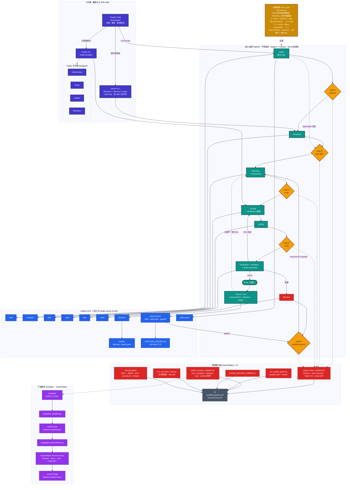

# 架構流程圖 Architecture Diagram

完整架構與流程一覽：**三代理**（Claude · Gemini · Codex）、**六階五關**、**九型工件**、**驗證關卡組（Guard Battery）**、**下游散布**，以及 **PDCA × TAO 治理雙環**。

Gate 對應以 [`docs/orchestration.md`](https://github.com/arcobaleno64/council-forge/blob/master/docs/orchestration.md) 為準：**Gate A = Research · B = Planning · C = Code · D = Verification · E = Closure（blocked resume）**。

> 來源：`README.md`、`CLAUDE.md`、`docs/orchestration.md`、`docs/workflow_state_machine.md`。
